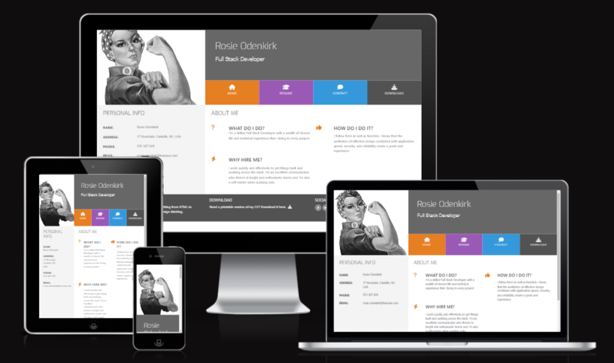

# Rosie’s Resume Website

This is a mini project for the User Centric Frontend Development module of the Code Institute’s Full Stack Web Development course. It is a responsive website that showcases the resume of Rosie Odenkirk, a fictional web developer. The website consists of four pages: home, resume, contact, and CV.

## Features
- The home page introduces Rosie and her professional profile, with a photo and a summary of her skills and interests.
- The resume page displays Rosie’s work history and skill sets in a visually appealing way, using a timeline and progress bars.
- The contact page allows users to submit project ideas to Rosie via a form, which will be connected to a JavaScript email API in the future.
- The CV page provides a link to download Rosie’s CV in PDF format, which opens in a new tab.
- The website is fully responsive and adapts to different screen sizes and devices.

## Technologies Used

- [HTML5](https://developer.mozilla.org/en-US/docs/Web/HTML): A markup language used for structuring and presenting content on the web
- [CSS3](https://developer.mozilla.org/en-US/docs/Web/CSS): A style sheet language used for describing the presentation of a document written in HTML
- [Bootstrap 4](https://getbootstrap.com/): A popular front-end framework for developing responsive and mobile-first websites
- [Font Awesome 5](https://fontawesome.com/): A web font and icon toolkit based on CSS and Less
- [Google Fonts](https://fonts.google.com/): A library of free licensed font families, an interactive web directory for browsing the library, and APIs for conveniently using the fonts via CSS and Android

Bootstrap 4 provides a grid system, components, and utilities that make it easy to design a responsive layout, while Font Awesome 5 and Google Fonts offer a variety of icons and fonts that enhance the appearance of the website.

## Installation
To run this project locally, you will need to clone this repository and open index.html in your browser of choice. Alternatively, you can view the live version of the website [here](#).

## Testing
The resume miniproject will be tested for functionality, usability, compatibility, and responsiveness using the following tools, methods, and frameworks:

- [Chrome DevTools](https://developers.google.com/web/tools/chrome-devtools): A set of web developer tools that allows you to inspect, edit, and debug the HTML, CSS, and JavaScript code of your web page, as well as simulate different devices, screen sizes, and network conditions.
- [W3C Markup Validation Service](https://validator.w3.org/): A tool that checks the validity and syntax of your HTML code and reports any errors or warnings.
- [W3C CSS Validation Service](https://jigsaw.w3.org/css-validator/): A tool that checks the validity and syntax of your CSS code and reports any errors or warnings.
- [Lighthouse](https://developers.google.com/web/tools/lighthouse): A tool that audits the performance, accessibility, best practices, and SEO of your web page and provides a score and a report for each category.

## Credits
The content, media, and assistance for the resume project are obtained from the following sources:

- Content: The text content for the website was partly inspired by the Code Institute’s video tutorial on how to create the resume project.
- Assistance: The guidance and support for the resume project were provided by the Code Institute, an online platform that offers courses on web development and software engineering.

## Acknowledgments
I would like to thank the Code Institute, for providing the video tutorial, the starter code, and the learning materials for the resume project.

## Contributing
I welcome any feedback, suggestions, or contributions to this project. If you are interested, please feel free to contact me or open an issue or a pull request on GitHub. Thank you! 😊